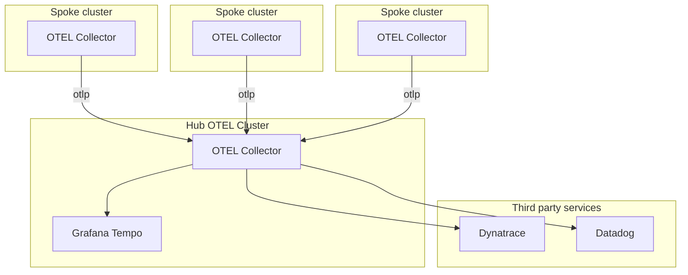

MCOA - Distributed Tracing
--------------------------

For all managed clusters the fleet administrator is required to provide a single `OpenTelemetryCollector` resource stanza that describes the OpenTelemetry forwarding configuration for the entire fleet in the default namespace `open-cluster-management`.

One `OpenTelemetryCollector` instance is deployed per spoke cluster. It reports its OpenTelemetry data to a Hub OTEL Cluster (note that this cluster can be different from the RHACM Hub cluster). The Hub OTEL Cluster exports the received telemetry to an storage (like Grafana Tempo or a third-party service).



## Enable tracing

### Prerequisites

* Check the [RHACM documentation](https://access.redhat.com/documentation/en-us/red_hat_advanced_cluster_management_for_kubernetes/2.9).
* A Hub cluster with RHACM installed and, at least, one spoke cluster.


### How to collect traces
To enable distributed traces collection using OpenTelemetry Collector instances, follow these steps:

1. **Install the add-on in the Hub cluster**: check the documentation from [CONTRIBUTING.md](../../CONTRIBUTING.md).
2. **Create the Authorization `ConfigMap`**: the authorization `ConfigMap` contains what kind of authorization do we want to use for the different exporters to use in the OpenTelemetry Collectors that will be deployed in the spoke clusters. Example configuration for the `otlphttp` exporter:
    ```yaml
    apiVersion: v1
    kind: ConfigMap
    metadata:
        name: tracing-auth
        namespace: open-cluster-management
    labels:
        mcoa.openshift.io/signal: "tracing"
    data:
        otlphttp: mTLS
    ```

    Valid values are `StaticAuthentication`, `ManagedAuthentication`, `mTLS` and `MCO`.
    Note the `ConfigMap` must be created in the `open-cluster-management` namespace with the `mcoa.openshift.io/signal` label equal to `tracing`.

3. **Create the Exporters ConfigMap**: this `ConfigMap` adds specific configuration to an specific exporter. The `tracing.mcoa.openshift.io/target-output-name` references the exporter to configure. Example `ConfigMap`:
    ```yaml
    apiVersion: v1
    kind: ConfigMap
    metadata:
        name: tracing-urls
        namespace: open-cluster-management
    annotations:
        tracing.mcoa.openshift.io/target-output-name: "otlphttp"
    labels:
        mcoa.openshift.io/signal: "tracing"
    data:
        endpoint: http://collector.namespace.svc
    ```

    Currently, the only option available is `endpoint`.

    Note the `ConfigMap` must be created in the `open-cluster-management` namespace with the `mcoa.openshift.io/signal` label equal to `tracing`.

4. **Create the OpenTelemetry Collector template in the Hub Cluster**: this `OpenTelemetryCollector` instance will be used to create the OpenTelemetry Collector instances in the spoke clusters. The credentials will be automatically created and set depending on the configuration provided in the previous steps. Receivers and processors can be added depending on the user needs. Example `OpenTelemetryCollector` instance:
    ```yaml
    apiVersion: opentelemetry.io/v1alpha1
    kind: OpenTelemetryCollector
    metadata:
        name: spoke-otelcol
        namespace: open-cluster-management
    spec:
        config: |
            receivers:
                jaeger:
                    protocols:
                    grpc:
                otlp:
                    protocols:
                    grpc:
                    http:
            processors:
            exporters:
                otlphttp:
            service:
                pipelines:
                    traces:
                        receivers: [jaeger,otlp]
                        processors: []
                        exporters: [otlphttp]
    ```
5. **Create the `ManagedClusterAddOn` resource in the namespace of the spoke cluster**: reference the different created `ConfigMaps` and the `OpenTelemetryCollector` instance. If you didn't disable the other telemetry signals (check [how to do it here](../../CONTRIBUTING.md)), more configuration might be required. Example of `ManagedClusterAddOn`:
    ```yaml
    kind: ManagedClusterAddOn
    metadata:
    name: multicluster-observability-addon
    namespace: cluster1
    spec:
    installNamespace: open-cluster-management-agent-addon
    configs:
    - resource: configmaps
        name: tracing-auth
        namespace: open-cluster-management
    - resource: configmaps
        name: tracing-urls
        namespace: open-cluster-management
    - resource: opentelemetrycollectors
        name: spoke-otelcol
        namespace: multicluster-observability-addon
    ```

6. **Verify the installation**: after a while, the [Red Hat build of OpenTelemetry](https://docs.openshift.com/container-platform/4.14/otel/otel-release-notes.html) will be deployed in the spoke cluster and an `OpenTelemetryCollector` instance will be created in the `open-cluster-management` namespace.

7. **Send traces to the OpenTelemetryCollectors**: now, you can send traces from your workloads to the ``OpenTelemetryCollector`` local instances. The traces will be forwarded according to the configuration you specified.
