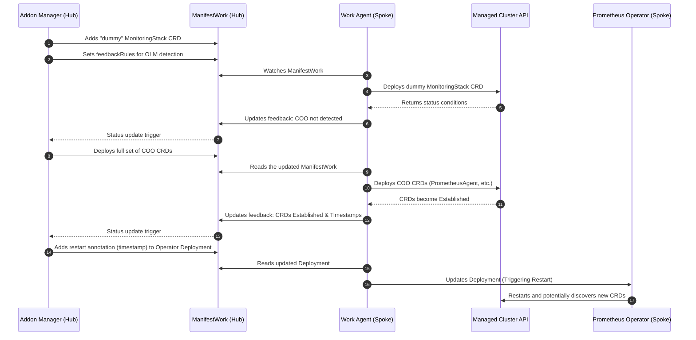
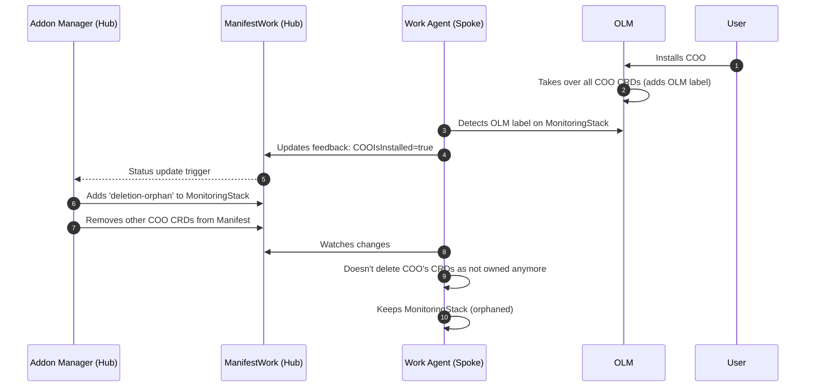
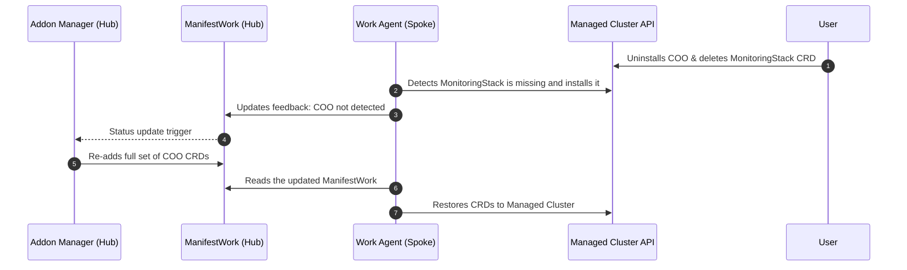

# Metrics Package

## CRD Management for Cluster Observability Operator (COO)

The Metrics package in MCOA leverages the **Cluster Observability Operator (COO)** CRDs when they are present on a managed cluster. MCOA must dynamically detect COO's presence and adapt its configuration to support the installation and uninstallation of COO while the addon is running.

### COO Detection Strategy

To detect whether COO is installed, MCOA leverages the `feedbackRules` API from `ManifestWorks`.

#### Choosing the Detection Resource
A key challenge is selecting a stable resource for detection that does not negatively impact addon health:
- **Constraints**: `feedbackRules` can only be used on objects already present in the `ManifestWork`'s manifest list.
- **Why not use COO-only resources?**: If we include a resource that only exists when COO is installed, the addon will be marked as **Degraded** when COO is missing (as the resource won't be "Available").
- **Why not always include the full CRDs?**: If MCOA provides the CRDs and OLM (via COO) also tries to manage them, it leads to reconciliation conflicts and a degraded health status.

#### The "Dummy" CRD Solution
The chosen solution is to create a "dummy" `monitoringstacks` CRD with the minimum required fields to be accepted by the API server.
- **Update Strategy**: Set to `CreateOnly`. This ensures that when OLM installs COO and takes over the CRD, the `ManifestWork` agent does not try to revert OLM's changes, preventing conflicts and keeping the resource clean.
- **Continuous Feedback**: This dummy resource allows the OLM presence `feedbackRule` to work regardless of whether COO is currently installed.

### Adaptation Logic

1.  **COO Detected**: When `feedbackRules` indicate COO is present, MCOA removes the other COO CRDs from its `ManifestWork` to yield management to OLM and avoid Server-Side Apply (SSA) conflicts.
2.  **COO Uninstalled**: If a user uninstalls COO and deletes the `monitoringstacks` CRD, the `WorkAgent` recreates the dummy version (without the OLM label). This triggers MCOA to re-add the necessary CRDs to the `ManifestWork`.

### Operator Synchronization and Restarts

The OCM `WorkAgent` does not guarantee the order in which resources within a `ManifestWork` are deployed. This creates a potential race condition where the Prometheus Operator pod may start before its dependent CRDs (such as `PrometheusAgent` or `ScrapeConfig`) are fully established on the managed cluster.

To prevent locked states or synchronization issues:
- **Establishment Detection**: MCOA uses `feedbackRules` to monitor the `Established` condition and transition timestamps of the deployed CRDs.
- **Forced Restart**: Once the CRDs are established, MCOA injects a special annotation containing these timestamps into the Prometheus Operator's Deployment template.
- **Triggered Rollout**: This change triggers a standard Kubernetes rolling update, ensuring the operator restarts and correctly discovers the now-available CRDs.

### Ownership and Deletion Handling

To prevent accidental deletion of CRDs during transitions:
- **`deletion-orphan` label**: The `addon.open-cluster-management.io/deletion-orphan` label is set on the `monitoringstacks` CRD when COO is deployed.
- **Reasoning**: Since OLM does not override the existing ownership on this specific CRD (while it does on the others), MCOA would normally delete the CRD upon its own uninstallation. This annotation removes the ownership claim, ensuring the resource is not deleted by the `WorkAgent`. For the other CRDs (PrometheusAgent, ScrapeConfig, etc.), OLM takes full ownership during installation, which naturally displaces the MCOA ownership and prevents the `WorkAgent` from deleting them when they are removed from the manifest list.

### Hub-side CRD Dependencies
Note that `prometheusagents` and `scrapeconfigs` CRDs are not deployed on the hub by MCOA. These are installed by the **MultiCluster Observability (MCO)** operator as they are direct dependencies of the Addon Manager (MCOA).

## Lifecycle Sequence Diagrams

The following diagrams illustrate how MCOA manages the lifecycle of COO CRDs on managed clusters.

### 1. Initial Startup (COO Missing)

When MCOA starts and detects that COO is not present on the managed cluster, it takes responsibility for deploying the necessary CRDs.

### 2. COO Installation (Dynamic Transition)

When a user or OLM installs COO on the managed cluster, MCOA detects the transition and steps back to avoid management conflicts.

### 3. COO Uninstallation

If COO is removed, MCOA detects the deletion of the CRDs and restores its own managed versions.

