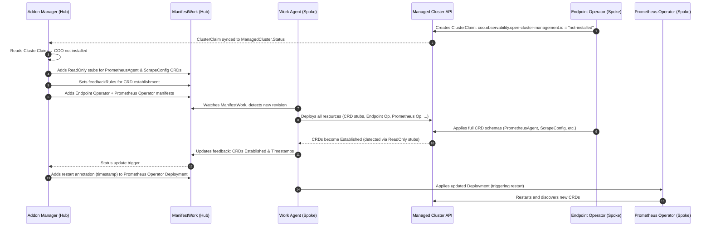
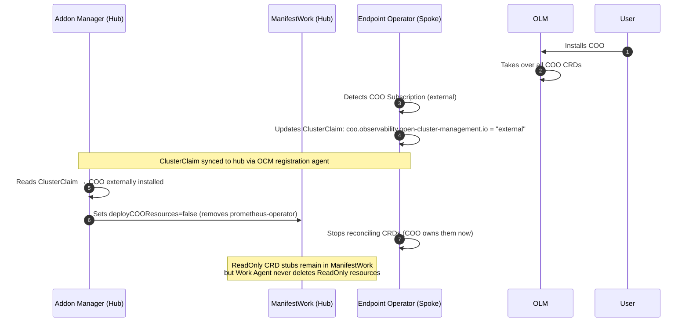
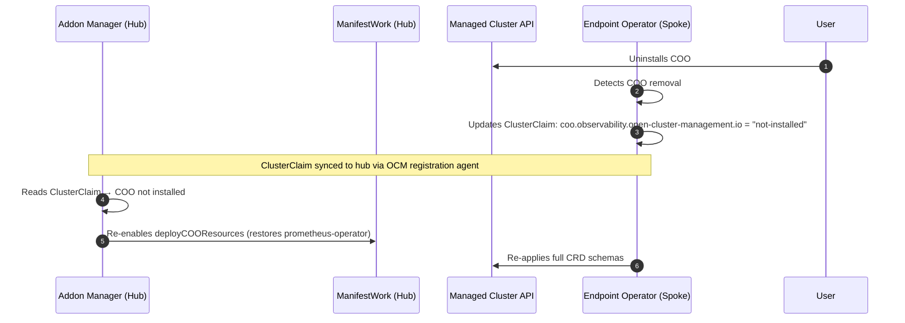

# Metrics Package

## CRD Management for Cluster Observability Operator (COO)

The Metrics package in MCOA leverages the **Cluster Observability Operator (COO)** CRDs when they are present on a managed cluster. MCOA must dynamically detect COO's presence and adapt its configuration at runtime.

### CRD Ownership and Footprint Minimization

When COO is missing on a managed cluster, we do not fully install COO itself because we only need its Prometheus Operator capabilities, and fully installing COO would spawn other workloads that we do not need. To limit our footprint and conserve resources on managed clusters (where CPU and memory can be scarce), we only install the necessary CRDs and run our own lightweight Prometheus Operator instance on the managed cluster to reconcile the metrics collection resources.

Furthermore, as most of these CRDs are large, we avoid storing them in the hub's etcd through ManifestWorks by having the endpoint operator apply them directly on the managed cluster. This avoids storing gigabytes of schema data in the hub's etcd when managing many clusters.

CRDs are split into two categories:

**CRDs managed by the Endpoint Operator (on the spoke)**

The following CRDs have large schemas. They are owned and applied directly by the endpoint operator on the managed cluster:

- `prometheusagents.monitoring.rhobs`
- `scrapeconfigs.monitoring.rhobs`
- `servicemonitors.monitoring.rhobs`
- `podmonitors.monitoring.rhobs`
- `probes.monitoring.rhobs`
- `prometheuses.monitoring.rhobs`
- `prometheusrules.monitoring.rhobs`

**CRDs managed by ManifestWork (on the hub)**

The addon manager ships lightweight "stub" CRDs via ManifestWork to leverage the `feedbackRules` API for detecting CRD establishment and triggering operator restarts.

| CRD | Strategy | Purpose |
|-----|----------|---------|
| `prometheusagents.monitoring.rhobs` | `ReadOnly` | Feedback only — hub reads `isEstablished` and timestamps to trigger prometheus-operator restart |
| `scrapeconfigs.monitoring.rhobs` | `ReadOnly` | Feedback only — same as above, also carries `prometheusOperatorVersion` |

These use `ReadOnly`: the Work Agent never creates or modifies them — it only reads their status to report feedback back to the hub. The endpoint operator is the sole owner of their content.

### COO Detection Strategy

MCOA detects whether COO is installed on a spoke cluster using **ClusterClaims** set by the endpoint-monitoring-operator.

The endpoint operator runs on the spoke, inspects the local OLM Subscriptions, and writes a single ClusterClaim:

- **Claim name**: `coo.observability.open-cluster-management.io`
- **Values**:
  - `"not-installed"` — COO is not present on the spoke
  - `"mcoa"` — COO was installed by MCOA itself
  - `"external"` — COO was installed by an external party (admin, OLM subscription)

ClusterClaims are automatically synced to `ManagedCluster.Status.ClusterClaims` on the hub by the OCM registration agent, so the hub controller reads them directly without any ManifestWork feedback.

#### Detection Logic

The hub-side function `IsCOOExternallyInstalledOnSpoke()` reads the ClusterClaim and returns:

| Claim value | Result | MCOA behavior |
|-------------|--------|---------------|
| `"not-installed"` | Not external | MCOA deploys its own prometheus-operator and CRDs |
| `"mcoa"` | Not external | COO installed by MCOA — MCOA keeps the Subscription but does not deploy its own prometheus-operator |
| `"external"` | Externally installed | COO installed by someone else — MCOA does not deploy COO resources |
| Empty / missing | Unknown (defer) | MCOA waits for endpoint operator to report |

This is used in two places with different helpers:
1. **COO install decision** (`InstallOfCOOOnSpokeIsNeeded` → `IsCOOExternallyInstalledOnSpoke`) — whether to install/keep the COO Subscription. Only backs off for `"external"`.
2. **COO resources deployment** (`COOInstalled` → `IsCOOInstalledOnSpoke` → `DeployCOOResources`) — whether to deploy the prometheus-operator and CRDs. Backs off for both `"mcoa"` and `"external"`, since in both cases COO already provides an operator.

### Adaptation Logic

1.  **No COO** (`"not-installed"`): MCOA deploys and manages its own Prometheus Operator and CRDs on the spoke.
2.  **COO installed by MCOA** (`"mcoa"`): MCOA keeps the COO Subscription but does not deploy its own prometheus-operator, since COO already provides one.
3.  **COO installed externally** (`"external"`): MCOA does not deploy COO resources and does not install a Subscription, deferring entirely to the external operator.
4.  **COO uninstalled**: If a user uninstalls COO, the endpoint operator updates the ClusterClaim to `"not-installed"`, and MCOA re-installs its own Prometheus Operator manifests on the managed cluster to ensure continuous metrics collection.

### Operator Synchronization and Restarts

The OCM `WorkAgent` does not guarantee the order in which resources within a `ManifestWork` are deployed. This creates a potential race condition where the Prometheus Operator pod may start before its dependent CRDs (such as `PrometheusAgent` or `ScrapeConfig`) are fully established on the managed cluster.

To prevent locked states or synchronization issues:
- **Establishment Detection**: MCOA uses `feedbackRules` on the `ReadOnly` CRD stubs to monitor the `Established` condition and transition timestamps of the deployed CRDs. Because the stubs are `ReadOnly`, the Work Agent reports feedback from whichever entity created the real CRD (endpoint operator, COO, or MCO).
- **Forced Restart**: Once the CRDs are established, MCOA injects a special annotation containing these timestamps into the Prometheus Operator's Deployment template.
- **Triggered Rollout**: This change triggers a standard Kubernetes rolling update, ensuring the operator restarts and correctly discovers the now-available CRDs.

### Ownership and Deletion Handling

To prevent accidental deletion of CRDs during transitions:
- **`deletion-orphan` annotation**: The `addon.open-cluster-management.io/deletion-orphan` annotation is conditionally set on the `monitoringstacks` CRD based on `.Values.deployCOOResources`.
- **Reasoning**: Since OLM does not override the existing ownership on this specific CRD (while it does on the others), MCOA would normally delete the CRD upon its own uninstallation. The annotation removes the ownership claim, ensuring the resource is not deleted by the `WorkAgent` when COO is managing the CRDs. If COO is not installed, the annotation is omitted so that MCOA cleans up the CRD upon uninstallation. For the endpoint-operator-managed CRDs, the endpoint operator is their sole SSA owner. When COO installs and takes over, it displaces that ownership and the endpoint operator stops reconciling them.
- **`ReadOnly` CRDs**: Resources with `ReadOnly` update strategy are never deleted by the Work Agent, regardless of whether they are present in the manifest list.

### Hub-side CRD Dependencies
Note that `prometheusagents` and `scrapeconfigs` CRDs are not deployed on the hub by the endpoint operator. These are installed by the **MultiCluster Observability (MCO)** operator as they are direct dependencies of the Addon Manager (MCOA). The `ReadOnly` feedback stubs still work on hub because MCO's CRDs satisfy the existence check.

## Lifecycle Sequence Diagrams

The following diagrams illustrate how MCOA manages the lifecycle of COO CRDs on managed clusters.

### 1. Initial Startup (COO Missing)

When MCOA starts and detects that COO is not present on the managed cluster, the endpoint operator takes responsibility for deploying the necessary CRDs directly on the spoke.

```mermaid
sequenceDiagram
    autonumber
    participant AddonManager as Addon Manager (Hub)
    participant ManifestWork as ManifestWork (Hub)
    participant WorkAgent as Work Agent (Spoke)
    participant ManagedCluster as Managed Cluster API
    participant EndpointOp as Endpoint Operator (Spoke)
    participant PromOperator as Prometheus Operator (Spoke)

    EndpointOp->>ManagedCluster: Creates ClusterClaim: coo.observability.open-cluster-management.io = "not-installed"
    ManagedCluster-->>AddonManager: ClusterClaim synced to ManagedCluster.Status
    AddonManager->>AddonManager: Reads ClusterClaim → COO not installed
    AddonManager->>ManifestWork: Adds ReadOnly stubs for PrometheusAgent & ScrapeConfig CRDs
    AddonManager->>ManifestWork: Sets feedbackRules for CRD establishment
    AddonManager->>ManifestWork: Adds Endpoint Operator + Prometheus Operator manifests
    WorkAgent->>ManifestWork: Watches ManifestWork, detects new revision
    WorkAgent->>ManagedCluster: Deploys all resources (CRD stubs, Endpoint Op, Prometheus Op, ...)
    EndpointOp->>ManagedCluster: Applies full CRD schemas (PrometheusAgent, ScrapeConfig, etc.)
    ManagedCluster-->>WorkAgent: CRDs become Established (detected via ReadOnly stubs)
    WorkAgent->>ManifestWork: Updates feedback: CRDs Established & Timestamps
    ManifestWork-->>AddonManager: Status update trigger
    AddonManager->>ManifestWork: Adds restart annotation (timestamp) to Prometheus Operator Deployment
    WorkAgent->>PromOperator: Applies updated Deployment (triggering restart)
    PromOperator->>ManagedCluster: Restarts and discovers new CRDs
```

### 2. COO Installation (Dynamic Transition)

When a user or OLM installs COO on the managed cluster, MCOA detects the transition via ClusterClaims and steps back to avoid management conflicts.

```mermaid
sequenceDiagram
    autonumber
    participant AddonManager as Addon Manager (Hub)
    participant ManifestWork as ManifestWork (Hub)
    participant EndpointOp as Endpoint Operator (Spoke)
    participant OLM
    participant User

    User->>OLM: Installs COO
    OLM->>OLM: Takes over all COO CRDs
    EndpointOp->>EndpointOp: Detects COO Subscription (external)
    EndpointOp->>EndpointOp: Updates ClusterClaim: coo.observability.open-cluster-management.io = "external"
    Note over EndpointOp,AddonManager: ClusterClaim synced to hub via OCM registration agent
    AddonManager->>AddonManager: Reads ClusterClaim → COO externally installed
    AddonManager->>ManifestWork: Sets deployCOOResources=false (removes prometheus-operator)
    EndpointOp->>EndpointOp: Stops reconciling CRDs (COO owns them now)
    Note over ManifestWork: ReadOnly CRD stubs remain in ManifestWork<br/>but Work Agent never deletes ReadOnly resources
```

### 3. COO Uninstallation

If COO is removed, MCOA detects the deletion via ClusterClaims and the endpoint operator restores its managed versions.

```mermaid
sequenceDiagram
    autonumber
    participant AddonManager as Addon Manager (Hub)
    participant ManifestWork as ManifestWork (Hub)
    participant ManagedCluster as Managed Cluster API
    participant EndpointOp as Endpoint Operator (Spoke)
    participant User

    User->>ManagedCluster: Uninstalls COO
    EndpointOp->>EndpointOp: Detects COO removal
    EndpointOp->>EndpointOp: Updates ClusterClaim: coo.observability.open-cluster-management.io = "not-installed"
    Note over EndpointOp,AddonManager: ClusterClaim synced to hub via OCM registration agent
    AddonManager->>AddonManager: Reads ClusterClaim → COO not installed
    AddonManager->>ManifestWork: Re-enables deployCOOResources (restores prometheus-operator)
    EndpointOp->>ManagedCluster: Re-applies full CRD schemas
```